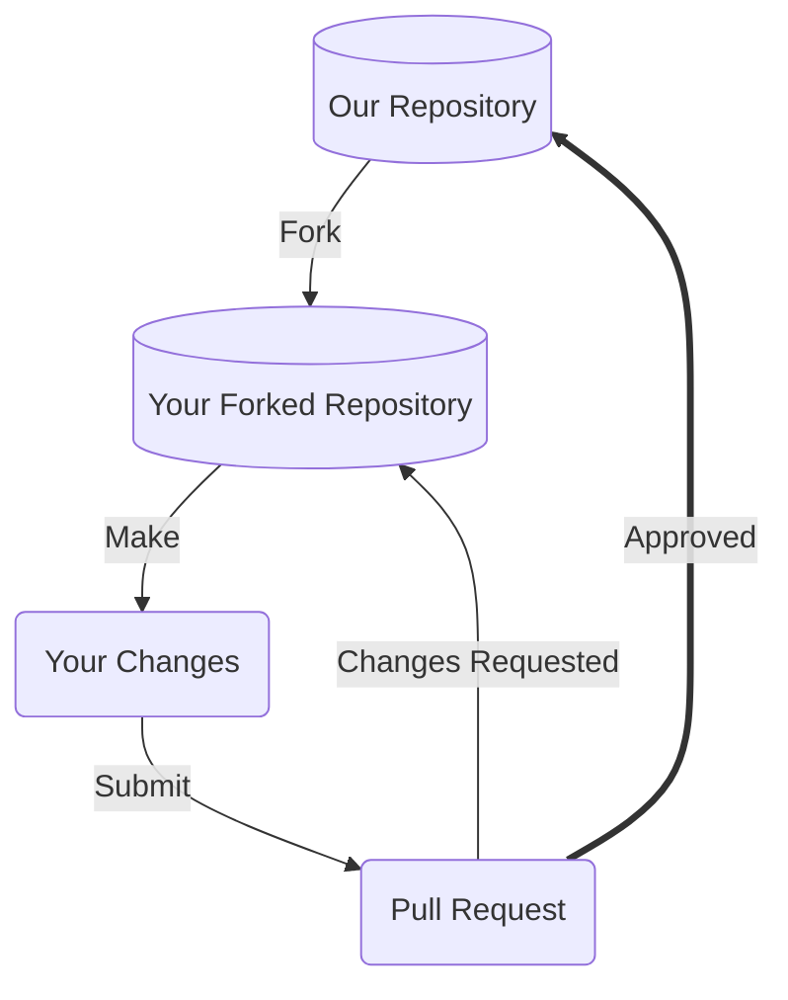

# Contributing Guide

Thank you for taking the time to consider contributing! We very much appreciate your time and effort. This document outlines the many ways you can contribute to our project, and provides detailed guidance on best practices.

We look forward to your help!

## Table of Contents

- [Prerequisites](#prerequisites)
  - [Code of Conduct](#code-of-conduct)
  - [Questions](#questions)
  - [Communication Channels](#communication-channels)
- [How to Contribute?](#how-to-contribute)
  - [License](#license)
  - [Submitting Bug Reports](#submitting-bug-reports)
  - [Submitting New Feature Requests](#submitting-new-feature-requests)
  - [Your First Code Contribution](#your-first-code-contribution)
    - [Developer Environment](#developer-environment)
    - [Good First Issues](#good-first-issues)
- [Our Development Process](#our-development-process)
  - [Issue Backlog](#issue-backlog)
  - [Forking and Branching](#forking-and-branching)
    - [Find or File an Issue](#find-or-file-an-issue)
    - [Choose the Right Branch to Fork](#choose-the-right-branch-to-fork)
  - [Make Your Changes](#make-your-changes)
  - [Submit a Pull Request](#submit-a-pull-request)
  - [Reviewing Pull Requests](#reviewing-pull-requests)
- [Development Guides](#development-guides)
  - [Git Commit Messages](#git-commit-messages)
  - [Python Styleguide](#python-styleguide)
  - [Code Documentation](#code-documentation)
    - [Docstrings](#docstrings)
    - [Inline Code Documentation](#inline-code-documentation)
    - [Documentation Organization](#documentation-organization)
    - [Writing Style](#writing-style)
    - [Media](#media)
    - [Design](#design)
  - [Code Testing Guidelines](#code-testing-guidelines)

## Prerequisites

Before you begin contributing to our project, it'll be a good idea to ensure you've satisfied the below pre-requisites. 

### Code of Conduct

Our Code of Conduct helps facilitate a positive interaction environment for everyone involved with the team, and provides guidance on what to do if you experience problematic behavior. Read more in our [CODE_OF_CONDUCT.md](CODE_OF_CONDUCT.md) (coming soon!), and make sure you agree to its terms. 


### Questions

Answering questions is an excellent way to learn more about our project, as well as get better known in our project community. 

Here are just a few ways you can help answer questions for our project:
- Answer open questions in our [discussion forum]([INSERT LINK TO DISCUSSION FORUM])
- Answer open questions mentioned in our [issue tracking system]([INSERT LINK TO YOUR ISSUE TRACKING SYSTEM])
<!-- ADD TO OR MODIFY DEPENDING ON YOUR COMMUNICATION CHANNELS LISTED AT THE BEGINNING OF THIS DOCUMENT-->

When answering questions, keep the following in mind:
- Be polite and friendly. See our [Code of Conduct](CODE_OF_CONDUCT.md) recommendations as you interact with others in the team.
- Repeat the specific question you are answering, followed by your suggestion.
- If suggesting code, repeat the line of code that needs to be altered, followed by your alteration
- Include any post-steps or checks to verify your answer can be reproduced 


### Communication Channels

Before contributing to our project, please familiarize yourself with our communication channels, and socialize potential contributions early to get feedback. This will give you context for your contributions, and help ensure a smooth process for submission, review, and acceptance of your contributions.

Our communication channels are:
- [Issue tracking system]([INSERT LINK TO ISSUE TRACKING SYSTEM]) - a regularly monitored area to report issues with our software or propose changes
- [Discussion board](INSERT LINK TO DISCUSSION BOARD OR MAILING LIST) - a permanently archived place to hold conversations related to our project, and to propose as well as show+tell topics to the contributor team. This resource can be searched for old discussions.
- [INSERT ADDITIONAL COMMUNICATION CHANNELS FOR YOUR PROJECT, EX: SLACK, TWITTER, YOUTUBE, ETC.]

## How to Contribute?

⚠️ It's **highly** advised that you take a look at our [issue tracking system]([INSERT LINK TO YOUR ISSUE TRACKING SYSTEM]) before considering any code contributions. Here's some guidelines:
1. Check if any duplicate issues exist that cover your code contribution idea / task, and add comments to those tickets with your thoughts.
2. If no duplicates exist, create a new issue ticket and get a conversation started before making code changes using our [communication channels](#communication-channels).

Once you have a solid issue ticket in hand and are ready to work on code, you'll want to:
1. Ensure you have development [prerequisites](#prerequisites) cleared.
2. Have your [development environment](#developer-environment) set up properly.
3. Go through our [development process](#our-development-process), including proposing changes to our project.

Some guidelines for code-specific contributions:
- **Do your homework** - read-up on necessary documentation, like `README.md`s, developer documentation, and pre-existing code to see the intention and context necessary to make your contribution a success. It's important to _communicate_ what you're working on through our project [communication channels](#communication-channels) and get buy-in from frequent contributors - this will help the project be more receptive to your contributions! 
- **Ask questions** - its important to ask questions while you work on your contributions, to check-in with frequent contributors on the style and the set of expectations to make your code contribution work well with pre-existing project code. Use our [communication channels](#communication-channels)
- **Keep positive** - code contributions, by their nature, have direct impacts on the output and functionality of the project. Keep a positive spirit as your code is reviewed, and take it in stride if core contributors take time to review, give you suggestions for your code or respectfully decline your contribution. This is all part of the process for quality open source development. 
- **Comments** - include *useful* comments throughout your code that explain the intention of a code block, not a step-by-step analysis. See our [inline code documentation](#inline-code-documentation) section for specifics. 

[INSERT ADDITIONAL SECTIONS HERE FOR MORE SPECIFIC CLASSES OF CODE CONTRIBUTIONS DEPENDING ON YOUR MODULES, LANGUAGES, PLATFORMS IN USE BY YOUR PROJECT. THE MORE DETAILS YOU OFFER, THE MORE LIKELY SOMEONE IS TO UNDERSTAND HOW TO CONTRIBUTE]
<!-- EXAMPLE: APIs, PyTest, etc. -->

### License

Our project's licensing terms, including rules governing redistribution, are documented in our [LICENSE](LICENSE) file. Please take a look at that file and ensure you understand the terms. This will impact how we, or others, use your contributions.


### Submitting Bug Reports

Resolving bugs is a priority for our project. We welcome bug reports. However, please make sure to do the following prior to submitting a bug report:
- **Check for duplicates** - there may be a bug report already describing your issue, so check the [issue tracking system]([INSERT LINK TO YOUR ISSUE TRACKING SYSTEM]) first.

Here's some guidance on submitting a bug issue:
1. Navigate to our [issue tracking system]([INSERT LINK TO YOUR ISSUE TRACKING SYSTEM]) and file a new issue
2. Select a bug template (if available) for your issue
   1. Fill out the template fields to the best of your ability, including output snippets or screenshots where applicable
3. Follow the general guidelines below for extra information about your bug
   1. Include a code snippet if you have it showcasing the bug
   2. Provide reproducible steps of how to recreate the bug
   3. If the bug triggers an exception or error message, include the *full message* or *stacktrace*
   4. Provide information about your operating system and the version of our project you're using

### Submitting New Feature Requests

We welcome new feature requests to help grow our project. However, please make sure to do the following prior to submitting a new feature request:
- **Check for duplicates** - there may be a new feature issue already describing your issue, so check the [issue tracking system]([INSERT LINK TO YOUR ISSUE TRACKING SYSTEM]) first
- **Consider alternatives** - is your feature really needed? Or is there a feature within our project or with a third-party that may help you achieve what you want?

Here's some guidance on submitting a new feature issue:
1. Navigate to our [issue tracking system]([INSERT LINK TO YOUR ISSUE TRACKING SYSTEM]) and file a new issue
2. Select a new feature template (if available) for your issue
   1. Fill out the template fields to the best of your ability


### Your First Code Contribution

#### Developer Environment

For patch contributions, see our [Developer Documentation]([INSERT YOUR DEVELOPMENT GUIDE LINK HERE]) for more details on how to set up your local environment to contribute to our project. 

To submit patches (if using Git), you'll want to ensure you have, at minimum:
1. An account on GitHub.
2. An installation of `git` on your local machine.
3. The ability to edit, build, and test our project on your local machine. Again, see our [README.md](README.md) or detailed developer guide for more details 

#### Good First Issues

Issue tickets can vary in complexity, and issues labeled with `good first issue` labels are often a great way to get started with the project as a newcomer. 

Take a look at our [issue tracking system]([INSERT LINK TO YOUR ISSUE TRACKING SYSTEM]), and filter by `good first issue` for issues that are low-complexity, and that will help you get familiar with our issue tracking and patch submission process.


## Our Development Process

This section outlines the process of submitting changes to the repository. The following diagram gives an overview of the process, with details on each step in the subsequent subsections.



### Issue Backlog

> *Do you like to talk about new features, changes, requests?*

Issue tickets are a very simple way to get involved in our project. It also helps new contributors get an understanding of the project more comprehensively. This is a great place to get started with the project if you're not sure where to start. 

See our list of issues at: [INSERT LINK TO YOUR ISSUE TRACKING SYSTEM]

### Forking and Branching

Forking our repository, as opposed to directly committing to a branch is the preferred way to propose changes. 

See [this GitHub guide](https://docs.github.com/en/get-started/quickstart/fork-a-repo) on forking for information specific to GitHub.com

#### Find or File an Issue

Make sure people are aware you're working on a patch! Check out our [issue tracking system]([INSERT LINK TO YOUR ISSUE TRACKING SYSTEM]) and find an open issue you'd like to work against, or alternatively file a new issue and mention you're working on a patch.

#### Choose the Right Branch to Fork

Our project typically has the following branches available, make sure to fork either the default branch or a branch someone else already tagged with a particular issue ticket you're working with.
- `main`[INSERT DEFAULT VCS BRANCH NAME HERE] - default branch
- [INSERT ADDITIONAL TYPICAL VCS BRANCH NAMES HERE] - 

### Make Your Changes

Within your local development environment, this is the stage at which you'll propose your changes, and commit those changes back to version control. See the [README.md](README.md) or [Development Guide](#development-guide) for more specifics on how to go about making the changes.

### Submit a Pull Request

Pull requests are the core way our project will receive your patch contributions. Navigate to your branch on your own fork within the version control system, and submit a pull request or submit the patch text to our project. 

Please make sure to provide a meaningful text description to your pull requests, whenever submitted. Our pull-request template will be auto-generated for you when you create your pull-request. See the template [here]([INSERT LINK TO YOUR PULL REQUEST TEMPLATE, ex: .github/PULL_REQUEST_TEMPLATE.md]). 

**Working on your first Pull Request?** See guide: [How to Contribute to an Open Source Project on GitHub](https://kcd.im/pull-request)


### Reviewing Pull Requests

Reviewing pull-requests, or any kinds of proposed patch changes, is an art. That being said, we follow the following best practices:
- **Intent** - is the purpose of your pull-request clearly stated?
- **Solution** - is your pull-request doing what you want it to?
- **Correctness** - is your pull-request doing what you want it to *correctly*?
- **Small Patches** - is your patch of a level of complexity and brevity that it can actually be reviewed by a human being? Or is does it involve too much content for one pull request?
- **Coding best practices** - are you following best practices in the coding / contribution language being used?
- **Readability** - is your patch readable, and ultimately maintainable, by others?
- **Reproducibility** - is your patch reproducible by others?
- **Tests** - do you have or have conducted meaningful tests?

Reviewing others' contributions is a great way to learn about best practices in both contributions as well as software. 

Take a look at our [pull requests tracking system]([INSERT LINK FOR PULL REQUESTS TRACKING SYSTEM]), and try the following options for providing a review:
1. Read the code / patch associated with the pull-request, and take note of any coding, bug, or documentation issues if found
2. Try to recreate the pull-request patch on your local machine, and report if it has issues with your system in particular
3. Scan over suggested feedback from other contributors, and provide feedback if necessary


## Development Guide

### Git Commit Messages
Commit messages to git should reference a ticket at the beginning of their title / summary line.  For example:

```
Issue #248 - Show an example commit message title
```

This makes sure that tickets are updated on GitHub with references to commits that are related to them.

Commit should always be atomic. Keep solutions isolated whenever possible. Filler commits such as "clean up white space" or "fix typo" should be merged together before making a pull request, and significant sub-feature branches should be [rebased](https://www.youtube.com/results?search_query=git+rebase) to preserve commit history. Please ensure your commit history is clean and meaningful!


### Python Styleguide

(coming soon!)

### Code Documentation 

Documentation is the core way our users and contributors learn about the project. We place a high value on the quality, thoroughness, and readability of our documentation. Writing or editing documentation is an excellent way to contribute to our project without performing active coding. 

⚠️ It's **highly** advised that you take a look at our [issue-tracking system]([INSERT LINK TO YOUR ISSUE TRACKING SYSTEM]) before considering any documentation contributions. Here's some guidelines:
1. Check if any duplicate issues exist that cover your documentation contribution idea / task, and add comments to those tickets with your thoughts.
2. If no duplicates exist, create a new issue ticket and get a conversation started before making documentation changes.

Some guidelines for documentation best practices (summarized from Google's [excellent documentation guide](https://google.github.io/styleguide/docguide/best_practices.html)):
- **Minimum viable docs** - don't do less documentation than your users / developers need, but also don't do more
- **Changed code = changed docs** - if your code has changed, remember to update your documentation
- **Delete old docs** - continually clean your documentation tree, and remove outdated docs regularly

#### Docstrings


#### Inline Code Documentation
For language-specific guidance on code documentation, including style guides, see [Google's list of language style guides](https://google.github.io/styleguide/) for a variety of languages. 

Additionally, take a look at Google's recommendations on [inline code documentation](https://google.github.io/styleguide/docguide/best_practices.html#documentation-is-the-story-of-your-code) for best practices. 


#### Documentation Organization

The overall structure of our project documentation is as follows:
- Source-controlled documentation
  - [README.md](README.md) - top-level information about how to run, build, and contribute to the project
  - [CODE_OF_CONDUCT.md](CODE_OF_CONDUCT.md) - best practices and guidance on how to work well with other people in the project, and suggestions on dealing with interpersonal issues
  - [CONTRIBUTING.md](CONTRIBUTING.md) - guidance on contributing to the project
  - `*.[INSERT YOUR CODING LANGUAGE FILE EXTENSIONS HERE]` - inline documentation available inside code files
- [INSERT ADDITIONAL DOCUMENTATION CLASSES AND ORGANIZATION STRUCTURE HERE, SEE EXAMPLE IN COMMENTS BELOW]

<!-- EXAMPLE:
- Source-controlled documentation
  - [README.md](README.md) - top-level information about how to run, build, and contribute to the project
  - [CODE_OF_CONDUCT.md](CODE_OF_CONDUCT.md) - best practices and guidance on how to work well with other people in the project, and suggestions on dealing with interpersonal issues
  - [CONTRIBUTING.md](CONTRIBUTING.md) - guidance on contributing to the project
  - `*.py` - inline documentation available inside code files' function headers and code blocks
  - [docs/](docs/)` - top-level directory containing source-controlled documentation built into statically hosted files on our documentation website
- Hosted documentation
  - [Wiki Main-page]()
    - [Wiki Sub-page 1]()
    - [Wiki Sub-page 2]() 
- Discussion Boards
  - [Discussion Board Topic 1]()
  - [Discussion Board Topic 2]()
- YouTube.com video tutorials
  - [Channel page 1]()
  - [Channel page 2]()
- Application Programming Interface (API) documentation
  - [Sub-module 1]()
  - [Sub-module 2]()
- etc.
-->

For directions on contributing to our source-controlled documentation:
1. Ensure you have development [prerequisites](#prerequisites) cleared.
2. Have your [development environment](#developer-environment) set up properly.
3. Go through our [development process](#our-development-process), including proposing changes to our project.

<!-- OPTIONAL FOR HOSTED DOCUMENTATION >
For directions on contributing to our hosted documentation:
1. 
2. 
3. 

[INSERT HOSTED DOCUMENTATION PLATFORM SPECIFIC INSTRUCTIONS HERE FOR HOW TO CONTRIBUTE]
-->

#### Writing Style

To ensure documentation is readable and consistent by newcomers and experts alike, here are some suggestions on writing style for English:
- Use gender neutral pronouns (they/their/them) instead of he/she/his/her 
- Avoid qualifiers that minimize the difficulty of a task at hand, e.g. avoid words like “easily”, “simply”, “just”, “merely”, “straightforward”, etc. Readers' expertise may not match your own, and qualifying complexity may deter some readers if the task does not match their level of experience. That being said, if a particular task is difficult or complex, do mention that. 

#### Media

Media, such as such as images, videos, sound files, etc., are an excellent way to explain documentation to a wider audience more easily. Include media in your contributions as often as possible.

When including media into our version-control system, it is recommended to use formats such as:
- Diagrams: [Mermaid](https://mermaid-js.github.io/mermaid/#/) format
- Images: JPEG format
- Videos: H264 MPEG format
- Sounds: MP3 format
<!-- ADD TO OR MODIFY ABOVE DEFAULT SUGGESTIONS -->

#### Design

Design files can help to guide new features and new areas of expansion for our project. We welcome these kinds of contributions.

Here are just a few ways you can help provide design recommendations for our project:
- Create visual mockups or diagrams to increase usability of our project applications. This can apply to user interfaces, documentation structuring, or even code architecture diagrams.
- Conduct user research to understand user needs better. Save your findings within spreadsheets that the project team / contributors can review.
- Create art, such as logos or icons, to support the user experience for the project

Each of the above can be contributed directly to repository code, and you should use our [development process](#our-development-process) to contribute your additions.


### Code Testing Guidelines

(coming soon!)

See [TESTING.md](#TESTING.md) for more information on testing.


